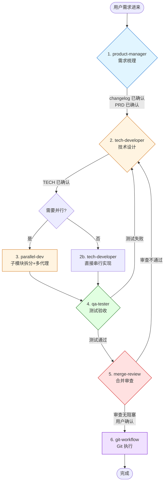
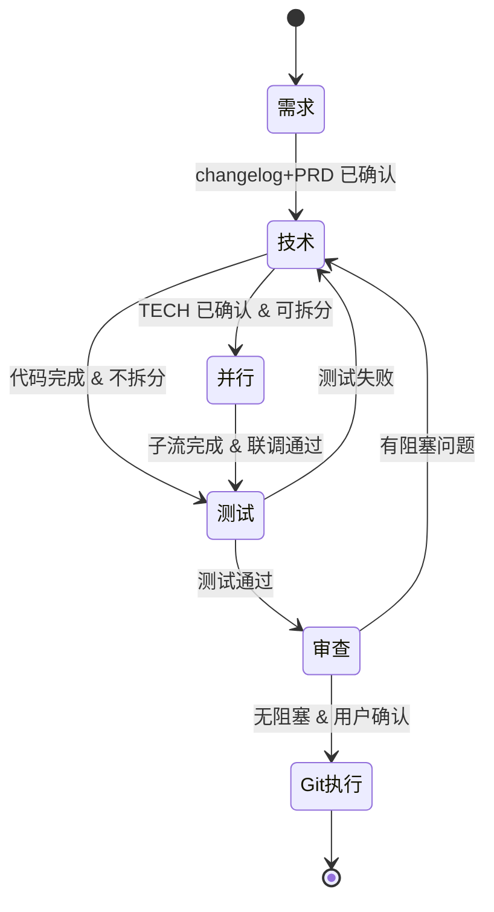

# 02 · 开发流程总览

> 六阶段流水线全景，以及每一阶段的进入/退出条件。

---

## 一、整体流水线



---

## 二、六阶段速查表

| # | 阶段 | Skill | 产出物 | 进入条件 | 退出条件（门禁） |
|---|------|-------|--------|---------|------------------|
| 1 | 需求 | `product-manager` | `changelog/LATEST.md` + 各模块 `PRD.md` | 用户提出需求 | changelog 已确认 + PRD 已确认 |
| 2 | 技术 | `tech-developer` | 各模块 `TECH.md` + 代码实现 | 上一阶段门禁通过 | TECH 已确认 + 代码完成 |
| 3 | 并行 | `parallel-dev` | 子模块分支 + worktree + 联调结果 | TECH 已确认 & 模块可拆分 | 所有子流完成 + 联调通过 |
| 4 | 测试 | `qa-tester` | 测试用例 + 测试报告 | 代码实现完成 | 测试结论明确 + 阻塞缺陷已关闭 |
| 5 | 审查 | `merge-review` | Findings + Merge Recommendation | QA 已给出结论 | 无阻塞问题 + 用户确认 |
| 6 | Git | `git-workflow` | MR 链接 / merge 结果 / tag | 审查通过 + 用户确认 | Git 操作完成 + 缓存已刷新 |

---

## 三、各阶段详解

### 3.1 需求阶段 · product-manager

**目标**：把用户的模糊描述转为结构化的 changelog + PRD。

**工作步骤**：

1. **复述理解** → 向用户确认需求（禁止擅自假设）
2. **先读再写** → 阅读 `docs/` 下的 README 和相关模块 PRD
3. **产出 changelog** → 写入 `docs/changelog/LATEST.md`，状态="待确认"
4. **用户确认 changelog** → 不得进入 PRD
5. **更新/新增 PRD** → 修改 `docs/modules/Fxx/PRD.md`
6. **用户确认 PRD** → changelog 状态改为"已确认"

**关键产物**：

```
docs/
├── changelog/LATEST.md            # 当前迭代变更清单
└── modules/
    ├── F01-user-sync/PRD.md
    ├── F02-token-mgmt/PRD.md
    └── ...
```

**门禁**：changelog 已确认 + 相关 PRD 已确认。

---

### 3.2 技术阶段 · tech-developer

**目标**：基于 changelog + PRD 产出 TECH.md，然后按 TECH.md 编码。

**工作步骤**：

1. **读 changelog** → 了解本次迭代完整变更范围
2. **读 PRD** → 了解验收标准
3. **读已有 TECH** → 了解当前技术设计
4. **产出/更新 TECH.md** → 包含架构图、API、数据库、配置项
5. **用户确认 TECH** → 不得进入编码
6. **代码实现** → 遵循项目已有编码规范
7. **更新 changelog 状态** → 改为"已落地"

**如果涉及多模块** → 交给 `parallel-dev` 拆分。

**门禁**：TECH 已确认 + 代码完成。

---

### 3.3 并行开发 · parallel-dev

**触发条件**（全部满足）：

- TECH 已确认
- 需求可拆成多个独立子模块，或跨多个目录/子系统
- 用户希望并行推进

**工作步骤**：

1. **列子模块清单** + 每个子模块的交付契约（目标/影响目录/依赖/完成标准）
2. **判断真正可并行的部分**
3. **Git 前置检查** → 若缺 `git worktree`，先交给 `git-workflow` 准备
4. **端口分配** → 写入 `.shared_cache/shared-data/port-registry.json`
5. **分派多个 `tech-developer` 执行流**
6. **汇总联调** → 检查接口一致性、共享配置、集成回归
7. **联调完成** → 交给 `qa-tester`

**分支策略**：

```text
feature-{大模块}
  └─ feature-{大模块}-{子模块1}
  └─ feature-{大模块}-{子模块2}
```

合并路径：子模块 → 大模块 → dev → pre → master。

---

### 3.4 测试阶段 · qa-tester

**工作步骤**：

1. **读 changelog + PRD + TECH** → 明确测试范围
2. **设计测试用例** → 使用用例模板，至少覆盖：
   - Happy Path
   - 边界值 / 等价类
   - 异常输入 / 错误处理
   - 权限 / 安全
   - 性能（如有指标）
3. **用户确认测试覆盖范围**
4. **编写测试脚本** → 按项目测试框架
5. **执行测试**
6. **Bug 记录 + 测试报告**
7. **交接 merge-review**

**Bug 严重级分级**：

| 级别 | 定义 |
|------|------|
| S1 致命 | 核心流程不可用 |
| S2 严重 | 主要功能缺陷，有绕行方案 |
| S3 一般 | 次要功能问题 |
| S4 轻微 | UI / 文案 / 性能细节 |

**门禁**：必须产出测试结论，关键缺陷（S1/S2）必须关闭或被用户接受。

---

### 3.5 审查阶段 · merge-review

**工作步骤**：

1. **确认源分支与目标分支**
2. **查看完整差异**（不只是最新 commit）
3. **审查清单**：
   - [ ] 逻辑错误、遗漏场景、回归风险
   - [ ] 安全隐患（密钥、输入校验、危险脚本）
   - [ ] 调试残留、临时配置、TODO
   - [ ] 测试覆盖是否缺口
   - [ ] 是否与 changelog/PRD/TECH 一致
4. **输出 Findings + Open Questions + Merge Recommendation**
5. **等待用户确认**
6. **交接 git-workflow**

**阻塞规则**：

- 存在未解决阻塞问题 → 退回 `tech-developer`
- QA 未通过 → 退回 `qa-tester`
- 用户未确认 → 停在本阶段

---

### 3.6 Git 执行阶段 · git-workflow

**职责边界**：只做 Git 操作，不做审查。

**分支策略**：

| 分支 | 用途 | 环境 | 合并来源 |
|------|------|------|---------|
| `master` | 生产 | 生产（打 tag 触发） | 只能从 `pre` 合并 |
| `pre` | 预发布 | 预发布环境 | feature/hotfix/dev |
| `dev` | 开发 | 测试环境 | feature/hotfix |
| `feature-*` | 功能分支 | 本地/测试 | 自由创建 |
| `hotfix-*` | 紧急修复 | 本地/测试 | 从 master 拉出 |

**高风险操作（需用户二次确认）**：

- `* → pre`：即将部署到预发环境
- `pre → master`：生产发布，校验权限 + 二次确认
- `master` 打 tag：触发生产部署

**禁止操作**：

- 任何分支直接合并到 `master`
- `master` 的 force push
- 自动解决冲突后静默提交

---

## 四、状态流与门禁矩阵



---

## 五、失败回退路径

| 当前阶段 | 失败原因 | 回退到 |
|---------|---------|--------|
| product-manager | 信息不足 | 继续追问用户（不前进） |
| tech-developer | PRD 不清 | product-manager |
| parallel-dev | 联调失败 | 对应子流或主开发流 |
| qa-tester | 测试失败 | tech-developer |
| merge-review | 发现阻塞 | tech-developer |
| git-workflow | 冲突/权限 | 暂停并请示用户 |

---

## 六、推荐调用方式

用户只需说任一触发语，AI 即进入对应阶段：

| 用户说 | AI 行为 |
|--------|--------|
| "按自动化编程流程来" | `auto-programming-workflow` 入口 → 判定阶段 → 分发 |
| "帮我梳理需求" / "写 PRD" | `product-manager` |
| "TECH 确认了，开始写代码" | `tech-developer` |
| "这块功能能不能并行做" | `parallel-dev` |
| "写下测试用例" / "跑测试" | `qa-tester` |
| "合并前帮我 review 一下" | `merge-review` |
| "创建分支 / 合并 / 打 tag" | `git-workflow` |
