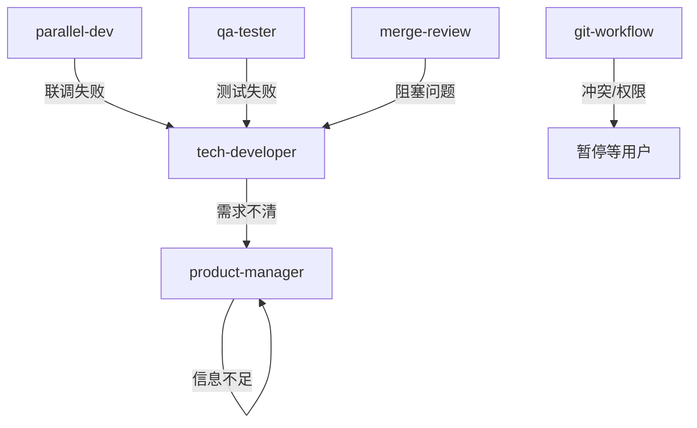

# 03 · 闭环方案设计

> 回答：**"怎么让 AI 编程不断链、可持续、可审计？"**

---

## 一、什么是"闭环"

闭环 = **需求有来源、决策有记录、产物有归档、回溯有证据、失败有回退**。

本方案的闭环四要素：

```text
1. 文档驱动    — 一切决策落成文档，成为下一阶段输入
2. 状态机      — 阶段间门禁明确，不跳步、不回溢
3. 共享记忆    — 跨会话/跨分支的持久化上下文
4. 回退路径    — 任何阶段失败都能找到明确退路
```

---

## 二、文档驱动闭环

### 2.1 数据流


### 2.2 文档之间的强引用

每份文档都**显式引用上游**：

- `TECH.md` 的开头引用对应 `PRD.md`
- `PRD.md` 的"变更记录"引用 changelog 版本号
- 测试报告引用对应 changelog & PRD & TECH
- 审查意见引用 "与 PRD/TECH 的一致性检查结果"

这样任一文档都能反向追溯到最初的需求来源，实现"需求可追溯性"。

### 2.3 文档状态机

每份 `changelog` 的 `状态` 字段遵循状态机：

```text
待确认 → 已确认 → 已落地
```

| 状态 | 含义 | 下游动作 |
|------|------|---------|
| 待确认 | 需求刚录完，等用户确认 | 禁止进入 TECH |
| 已确认 | 用户已确认 changelog + PRD | 可进入 TECH |
| 已落地 | 代码 + 测试 + 合并完成 | 下次迭代可覆盖 LATEST.md |

---

## 三、状态机与门禁

### 3.1 阶段门禁表

| 阶段转移 | 必需条件 |
|---------|----------|
| 需求 → 技术 | changelog 状态=已确认 ∧ 涉及 PRD 全部确认 |
| 技术 → 并行 | TECH 状态=已确认 ∧ 模块可拆分 ∧ worktree 已准备 |
| 技术 → 测试 | TECH 状态=已确认 ∧ 代码已完成 |
| 测试 → 审查 | 测试报告已产出 ∧ 阻塞 Bug 关闭或被接受 |
| 审查 → Git | 无阻塞 Findings ∧ 用户显式确认 |
| Git merge → pre | 用户确认预发部署 |
| Git merge → master | 来源是 pre ∧ 有 push 权限 ∧ 用户二次确认 |

### 3.2 实现手段

门禁通过 **Rules 层** 实现：

```markdown
# .cursor/rules/workflow-gates-and-handoffs.mdc
- Do not enter tech-developer implementation until changelog and PRD are confirmed.
- Do not enter qa-tester until implementation is complete.
- Do not enter merge-review until QA has produced an explicit result.
- Do not enter git-workflow for merge/tag until merge-review is complete.
```

Rules 是硬约束，AI 每次对话都会自动注入，不能跳步。

---

## 四、共享记忆（跨会话与跨分支）

### 4.1 为什么需要共享缓存

传统 AI 会话是"一次性"的：

- 切换分支 → 以前的决策丢失
- 新开对话 → 要重新加载上下文

解法：**`.shared_cache/` 约定**。

### 4.2 目录结构

```text
.shared_cache/                         ← 已加入 .gitignore
└── shared-data/
    ├── port-registry.json             # 并行开发端口注册表
    └── ...                            # 其他跨分支共享配置
```

### 4.3 读取策略

```text
需要 Git 元数据 →  直接执行 git 命令获取实时结果
业务共享数据   →  写入 .shared_cache/shared-data/
```

### 4.4 为什么这样设计

- **不受 git checkout 影响**：`.gitignore` 的文件切分支时不会被 checkout 覆盖
- **所有分支共享同一份**：跨分支的业务共享数据（端口、联调配置）自然一致
- **极大减少 git 命令调用**：避免每次都 `git branch -a` / `git tag`

所有缓存文件都要求 `last_updated`（ISO 8601）。

---

## 五、回退路径设计

### 5.1 四种失败模式



### 5.2 回退时的状态处理

- 回退到 `tech-developer`：TECH 保留，修复后只改差异部分
- 回退到 `product-manager`：PRD 保留，用"追加修订"方式更新
- 回退到 `qa-tester`：测试用例保留，只补充新场景

**原则：文档不重写，只增量修订。**

---

## 六、闭环的边界与例外

### 6.1 允许跳过的场景

- **Hotfix 紧急修复**：可走"简化流程"，但仍要最少补一份 TECH 说明
- **纯文档调整**：无代码影响时 QA 可简化为人工确认
- **spike / 原型**：先让 tech-developer 出 spike 代码，再回 product-manager 细化

### 6.2 不允许跳过的节点

- 任何代码合并到 `pre` 以上的分支 → 必须审查 + 用户确认
- 任何 `master` 的变更 → 必须来自 `pre`
- 任何 tag 创建 → 必须用户二次确认

---

## 七、可观测性与审计

每次迭代结束后，回头看下列"证据链"：

```text
docs/changelog/LATEST.md                     ← 谁、什么时候、为什么改
docs/modules/Fxx/PRD.md（diff）               ← 需求变成了什么
docs/modules/Fxx/TECH.md（diff）              ← 技术决策是什么
git log feature-xxx                          ← 实现路径
测试报告（可留存在 docs/changelog/子目录）     ← 验证过什么
审查意见（存 MR 描述或 docs/changelog/）       ← review 了什么
git tag -l                                   ← 发布了什么
```

这些节点拼起来就是完整的"可审计闭环"。

---

## 八、延伸阅读

- [04 - Skills 体系说明](./04-Skills体系说明.md)
- [05 - Rules 体系说明](./05-Rules体系说明.md)
- [06 - 项目文档建设思路](./06-项目文档建设思路.md)
