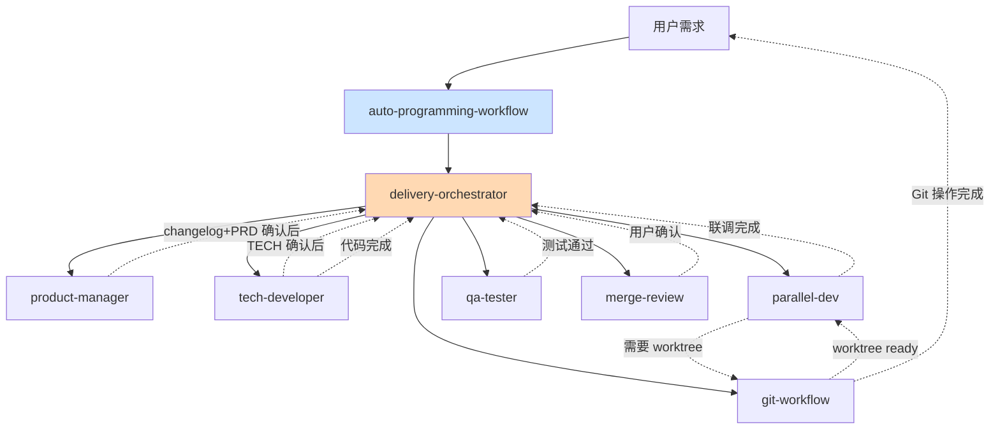
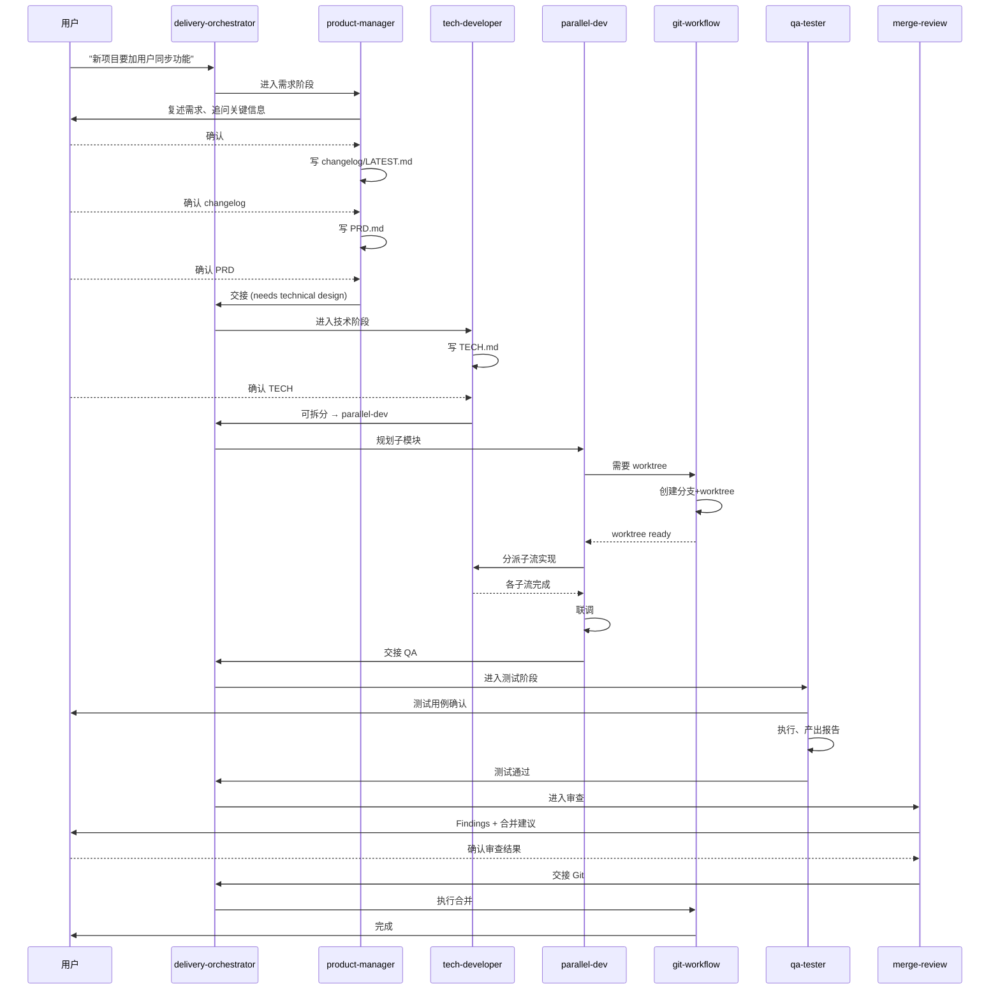

# 04 · Skills 体系说明

> 八个核心 Skill 的职责、协作关系与调用方式。

---

## 一、Skills 总览

| Skill | 层级 | 关键词 | 典型触发语 |
|-------|------|--------|-----------|
| `auto-programming-workflow` | 入口 | 跨项目通用入口 | "按自动化编程流程来" |
| `delivery-orchestrator` | 编排 | 阶段路由 | "从需求到合并帮我串起来" |
| `product-manager` | 阶段1 | 需求、PRD、changelog | "帮我梳理需求" |
| `tech-developer` | 阶段2 | TECH、架构、编码 | "TECH 确认了，开始写代码" |
| `parallel-dev` | 阶段2.5 | 并行、worktree、子模块 | "这几个模块能不能并行做" |
| `qa-tester` | 阶段3 | 测试、Bug、报告 | "写下测试用例" |
| `merge-review` | 阶段4 | 合并前审查 | "合并前帮我 review 一下" |
| `git-workflow` | 阶段5 | 分支、merge、tag | "合并到 pre / 打 tag" |

---

## 二、调用关系图



- `auto-programming-workflow` = 跨项目**入口**，判定"要不要走这套流程"
- `delivery-orchestrator` = **总控**，决定"当前这步应该调谁"
- 其余六个 = **执行者**，具体干活并回交给 orchestrator

---

## 三、Skill 详细职责

### 3.1 auto-programming-workflow

**定位**：跨项目复用总入口（个人技能，不依赖项目文件）。

**关键特性**：

- 不依赖当前项目必须有 `.cursor/rules/`
- 若项目已有自己的目录/命名约定，优先沿用
- 没有规范时，默认建 `changelog → PRD → TECH → QA → review → git` 骨架

**什么时候启用**：

- "按自动化编程流程来"
- "这个新项目也沿用之前那套"
- "从需求梳理到合并帮我串起来"

→ 进入后第一步：交给 `delivery-orchestrator` 判定阶段。

---

### 3.2 delivery-orchestrator

**定位**：总控编排，不直接出结果，只做路由 + 门禁校验。

**核心职责**：

1. 判断当前请求处于哪个阶段
2. 校验是否满足进入下一阶段的门禁
3. 触发正确的下游 Skill
4. 失败时把流程退回正确阶段

**交接语**（完成某阶段后必须明确给出下一跳）：

- 需求确认完成 → 交给 `tech-developer`
- TECH 确认且可拆分 → 交给 `parallel-dev`
- 开发完成 → 交给 `qa-tester`
- 测试通过 → 交给 `merge-review`
- 审查通过+用户确认 → 交给 `git-workflow`

---

### 3.3 product-manager

**强制流程**：

```text
用户提需求 → 【PM 沟通确认】→ 产出 changelog → 【用户确认】
          → 更新 PRD → 【用户确认】→ 交给 tech-developer
```

**必读**：

- `docs/changelog/LATEST.md`
- 涉及的各模块 `PRD.md`
- `docs/README.md`

**必产**：

- `docs/changelog/LATEST.md`（新迭代直接覆盖）
- 各模块 `docs/modules/Fxx/PRD.md`

**关键约束**：

- 每个节点向用户确认，禁止假设
- 发现矛盾/遗漏主动提出

---

### 3.4 tech-developer

**强制流程**：

```text
读 changelog+PRD → 产出 TECH.md → 【用户确认】→ 代码实现 → 改 changelog 状态为"已落地"
```

**技术方案必含要素**：

- 架构概述
- 模块/组件设计（Mermaid）
- 数据库设计（DDL、索引、迁移）
- API 设计（路径、请求/响应、错误码）
- 安全设计
- 配置项

**如何与并行开发衔接**：

> 如果 TECH 涉及多个可独立模块，优先交给 `parallel-dev`，不直接串行实现。

---

### 3.5 parallel-dev

**只在同时满足时启用**：

- TECH 已确认
- 改动可拆成多个独立模块
- 用户希望并行

**前置检查**：

- 并行基线分支存在
- `git worktree` 已准备好 → 否则先交给 `git-workflow`

**并行拆分流程**：

1. 列子模块清单 + 交付契约
2. 判断哪些真正可并行
3. 分配 `tech-developer` 子执行流
4. 汇总联调
5. 交给 `qa-tester`

**端口与 worktree**：

- 端口注册表：`.shared_cache/shared-data/port-registry.json`
- 规则：`dev` 固定 base_port，feature 从 `base_port+1` 递增

---

### 3.6 qa-tester

**输入**：

- `docs/changelog/LATEST.md`
- 涉及的 PRD.md（验收标准）
- 涉及的 TECH.md（技术细节）

**工作流**：

```text
分析测试需求 → 设计测试用例 → 【用户确认】→ 编写脚本 → 执行 → Bug 记录 → 测试报告 → 交 merge-review
```

**测试覆盖维度**：

- Happy Path
- 边界值 / 等价类
- 异常输入
- 权限 / 安全
- 性能

**Bug 严重级**：S1 致命 / S2 严重 / S3 一般 / S4 轻微。

---

### 3.7 merge-review

**只在满足时启用**：

- 代码已完成
- `qa-tester` 已给出测试结论
- 用户准备进入 MR / 合并

**审查清单**：

- [ ] 逻辑错误 / 遗漏场景 / 回归风险
- [ ] 安全隐患
- [ ] 调试残留 / TODO / 临时配置
- [ ] 是否缺少必要测试
- [ ] 是否与 changelog/PRD/TECH 范围一致

**产出格式**：

```markdown
## Findings
- [严重级别] 文件或范围：问题 + 建议

## Open Questions
- 待确认项

## Merge Recommendation
- 建议合并 / 不建议合并
- 理由
```

即使无问题也要写 **"未发现阻塞性问题"** 并说明残余风险。

---

### 3.8 git-workflow

**职责边界**：只做 Git 执行，不做审查。

**分支策略表**：

| 分支 | 环境 | 合并来源 |
|------|------|---------|
| `master` | 生产（打 tag 触发） | **只能从 `pre`** |
| `pre` | 预发布 | feature/hotfix/dev |
| `dev` | 测试 | feature/hotfix |
| `feature-*` | 本地/测试 | 自由创建 |
| `hotfix-*` | 本地/测试 | 从 master 拉出 |

**三个硬规则**：

1. 合并到 `pre` 必须用户确认
2. 合并到 `master` 必须：来源=pre + 权限 OK + 用户二次确认
3. `master` 禁止 force push

**Git 元数据**：分支、标签、远程和权限信息直接通过 `git` 命令实时查询，不维护 `.shared_cache/git/*.json`。

---

## 四、Skill 之间的数据流



---

## 五、自定义 Skill 的思路

当项目有特殊流程（例如多语言翻译、AI 模型训练）时，可以新增 Skill：

- 每个 Skill 一个目录 `~/.claude/skills/<name>/SKILL.md`
- 必含 **frontmatter**（`name` + `description`）
- `description` 用中英双语关键词写触发条件
- 明确列出**职责边界**与**不负责的事**
- 显式写出**上下游交接对象**

→ 见 [templates/skill-template.md](./templates/skill-template.md)。

---

## 六、完整 Skill 参考

| Skill | 完整文本 |
|-------|---------|
| auto-programming-workflow | [查看](./skills-reference/auto-programming-workflow.md) |
| delivery-orchestrator | [查看](./skills-reference/delivery-orchestrator.md) |
| product-manager | [查看](./skills-reference/agents/product-manager.md) |
| tech-developer | [查看](./skills-reference/agents/tech-developer.md) |
| parallel-dev | [查看](./skills-reference/parallel-dev.md) |
| qa-tester | [查看](./skills-reference/agents/qa-tester.md) |
| merge-review | [查看](./skills-reference/merge-review.md) |
| git-workflow | [查看](./skills-reference/git-workflow.md) |
