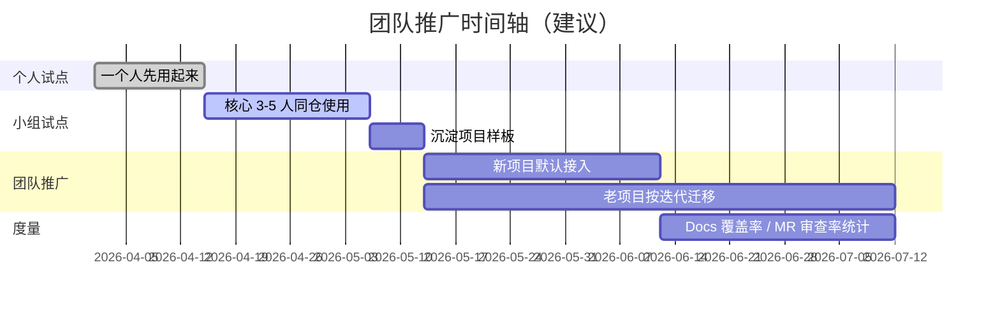

# 07 · 落地实施 Checklist

> 把这套方法论搬到**新项目**或**老项目**的完整清单。

---

## 一、新项目接入（0 → 1）

> 假设你正在开一个新仓库 `my-new-project/`，想立刻用上这套流程。

### Step 1 · 环境准备

- [ ] 安装 Cursor 或 Claude Code
- [ ] 确认全局 user_rules 已写入（中文、`auto-programming-workflow` 入口、`.shared_cache/` 约定）
- [ ] 确认 `~/.claude/skills/` 下已有 8 个核心 Skill（`auto-programming-workflow` / `delivery-orchestrator` / `product-manager` / `tech-developer` / `parallel-dev` / `qa-tester` / `merge-review` / `git-workflow`）

### Step 2 · 仓库骨架

```bash
mkdir -p my-new-project/docs/{overview,modules,changelog}
mkdir -p my-new-project/.cursor/rules
mkdir -p my-new-project/.shared_cache/{git,shared-data}
```

- [ ] `.gitignore` 追加 `.shared_cache/`

### Step 3 · 项目 Rules 落地

从 [templates/rules/](./templates/rules/) 复制：

- [ ] `.cursor/rules/workflow-stage-routing.mdc`
- [ ] `.cursor/rules/workflow-gates-and-handoffs.mdc`
- [ ] `.cursor/rules/shared-cache.mdc`（如果全局已有则跳过）

### Step 4 · 文档骨架

从 [templates/docs/](./templates/docs/) 复制：

- [ ] `docs/README.md` ← 改项目名、技术栈、一句话定位
- [ ] `docs/changelog/LATEST.md` ← 留空模板，第一次迭代覆盖

### Step 5 · 第一次迭代

向 AI 说："**按自动化编程流程来，帮我加 XX 功能**"。

AI 应该做的事：

1. 进入 `product-manager`
2. 复述需求、追问关键点
3. 写 `docs/changelog/LATEST.md`（状态=待确认）
4. 等你确认
5. 写/更新 `docs/modules/Fxx/PRD.md`
6. 等你确认
7. 交接 `tech-developer`
8. ...

**如果 AI 没有进入 product-manager**：

- 检查全局 user_rules 是否配置
- 检查 `.cursor/rules/workflow-stage-routing.mdc` 是否存在且 `alwaysApply: true`
- 明确说"交给 product-manager 处理"

---

## 二、老项目迁移（N → N+1）

> 假设你有一个已经写了几千行代码的老项目，想引入这套流程。

### Step 1 · 评估现状

- [ ] 项目已有文档放在哪？（README / Wiki / Notion / 没有）
- [ ] 已有分支策略是什么？（master/dev/feature 或其他）
- [ ] 已有测试体系吗？（pytest / jest / 手工）
- [ ] 有多少功能模块？（≤ 3 / 4-10 / > 10）

### Step 2 · 最小侵入方案

**尽量不动现有代码结构**，只补充：

```text
docs/
├── README.md            # 从零补（或迁移原 README）
├── overview/
│   └── architecture.md  # 梳理当前架构快照
├── modules/             # 按已有模块拆 PRD+TECH（可逐步补）
│   └── F01-xxx/
└── changelog/
    └── LATEST.md        # 从下次迭代开始记录
```

- [ ] `.cursor/rules/` 仍然需要那三份
- [ ] `.gitignore` 加 `.shared_cache/`

### Step 3 · 逆向梳理现有模块

不需要一次补完所有 PRD/TECH，可以按优先级：

| 优先级 | 动作 |
|--------|------|
| P0 | 本次迭代涉及的模块 → 立即补 PRD+TECH |
| P1 | 经常被改动的核心模块 → 排期补 |
| P2 | 稳定、几乎不变的工具模块 → 等下次涉及时再补 |

**套路**：

1. 向 AI 说："**帮我基于当前代码反推 F01 的 PRD 和 TECH**"
2. 用 `tech-developer` 读代码 → 产出 draft
3. 人工审阅、补充业务背景 → 确认
4. 归档

### Step 4 · 逐步引入流程

第一次迭代 = 用新流程 + 保留老习惯。常见过渡方案：

- 先只做 "**changelog + PRD 门禁**"，QA/审查/Git 沿用老流程
- 下一次迭代再加 "**TECH 门禁**"
- 再下一次迭代加 "**merge-review**"

目标是**3 个迭代内**完全切到新流程。

---

## 三、健康度自检清单

### 3.1 Rules 健康度

- [ ] `.cursor/rules/*.mdc` 每份都带 `alwaysApply: true`（或明确 globs）
- [ ] 全局 user_rules 里至少有"工作流入口 + 共享缓存 + 回复语言"三条
- [ ] 项目规则不和全局规则重复

### 3.2 Docs 健康度

- [ ] `docs/README.md` 存在且有完整导航
- [ ] 所有模块都有 `PRD.md`（允许 TECH 暂缺）
- [ ] `changelog/LATEST.md` 反映当前正在做的事
- [ ] 代码目录索引与实际代码一致

### 3.3 Skills 健康度

- [ ] 发一句"按流程来"能自动进入 product-manager
- [ ] changelog 没确认时，AI 拒绝写代码
- [ ] QA 未通过时，AI 拒绝进 merge-review

### 3.4 闭环健康度

做完一个迭代后，回头看能否凑齐**五件证据**：

- [ ] changelog（起因）
- [ ] PRD / TECH 的 diff（决策）
- [ ] 测试报告（验证）
- [ ] 审查意见（把关）
- [ ] git log + tag（发布）

五件齐 = 闭环完整。

---

## 四、常见问题排查

### 4.1 "AI 绕过了 PRD 直接写代码"

- 检查 `workflow-gates-and-handoffs.mdc` 是否写了"TECH 未确认不得开始编码"
- 是否过早地在对话里说了"好，那就这样"——AI 会理解为确认

### 4.2 "每次新对话 AI 都失忆"

- 检查 AI 是否读了 `docs/changelog/LATEST.md` 和对应 PRD/TECH
- 把"先读 docs"写进 Skill 的首条步骤（PM/TD/QA 的 SKILL.md 已有）
- 让 AI 在回答前先输出"我读到了什么"，验证上下文

### 4.3 ".shared_cache/ 不刷新"

- 检查 `shared-cache.mdc` 是否写了"变更后立即刷新"
- `git-workflow` Skill 里已有自动刷新触发点

### 4.4 "AI 建议直接合到 master"

- 检查 `git-workflow` 是否生效
- 人工否决并说 "`master` 必须来自 `pre`"
- AI 会写入当下会话记忆，后续自然遵守

---

## 五、推广路径建议



---

## 六、延伸阅读

- [08 - 最佳实践与反模式](./08-最佳实践与反模式.md)
- [templates/](./templates/)
