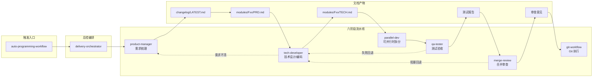

# AI 编程工作流知识库

> 版本：v1.0 · 更新日期：2026-04-17
> 作者：基于 sailvan-opengate 实战沉淀，跨项目通用

---

## 一、这份文档是什么

这是一套 **可跨项目复用的 AI 编程自动化工作流方法论**，解决的问题是：

- AI 协作写代码时，**上下文易失、阶段易跳、产出无约束、合并无审计**；
- 不同项目之间流程无法复用，每次都要重新"驯化"AI；
- 需求—设计—开发—测试—审查—合并的**闭环断裂**。

本知识库从三个层次给出完整解法：

| 层次 | 载体 | 作用 |
|------|------|------|
| **Rules** | `.cursor/rules/*.mdc` & 全局 user_rules | 在每次会话中自动注入**硬性约束**（阶段门禁、不得跳步） |
| **Skills** | `~/.claude/skills/<name>/SKILL.md` | 按角色封装**可组合的工作流**（PM / Dev / QA / Review / Git） |
| **Docs** | 项目 `docs/` 目录 | 沉淀**可被 AI 读取的项目记忆**（changelog / PRD / TECH） |

三层协同，形成 **需求 → 技术 → 开发 → 测试 → 审查 → 合并** 的自动化闭环。

---

## 二、阅读路线

### 快速入门（30 分钟）

1. [01 - 核心理念与架构](./01-核心理念与架构.md)
2. [02 - 开发流程总览](./02-开发流程总览.md)
3. [07 - 落地实施 Checklist](./07-落地实施Checklist.md)

### 深入了解（按需）

| 主题 | 文档 |
|------|------|
| 自动化闭环是如何形成的 | [03 - 闭环方案设计](./03-闭环方案设计.md) |
| 各阶段 Skill 的详细职责 | [04 - Skills 体系说明](./04-Skills体系说明.md) |
| 如何写 Rules 来约束 AI | [05 - Rules 体系说明](./05-Rules体系说明.md) |
| 项目 `docs/` 该怎么建 | [06 - 项目文档建设思路](./06-项目文档建设思路.md) |

### 模板库（拿来即用）

- [templates/rules/](./templates/rules/) —— `.cursor/rules/*.mdc` 模板
- [templates/docs/](./templates/docs/) —— changelog / PRD / TECH / 测试报告 / MR 模板
- [templates/skill-template.md](./templates/skill-template.md) —— 自定义 Skill 脚手架
- [skills-reference/](./skills-reference/) —— 八个核心 Skill 的完整参考

---

## 三、一图看全流程



---

## 四、目录结构

```
e:\开发文档\AI编程\
├── README.md                              # 本文件
├── 01-核心理念与架构.md                   # 三层协同模型、为什么要这样做
├── 02-开发流程总览.md                     # 六阶段流水线全景
├── 03-闭环方案设计.md                     # 文档驱动 + 状态机 + 共享缓存
├── 04-Skills体系说明.md                   # 八个 Skill 作用与协作
├── 05-Rules体系说明.md                    # Rules 层设计与编写规范
├── 06-项目文档建设思路.md                 # docs/ 目录约定、模块化拆分
├── 07-落地实施Checklist.md                # 新/老项目接入步骤
├── 08-最佳实践与反模式.md                 # 踩坑经验与推荐做法
├── templates/                             # 开箱即用的模板
│   ├── rules/
│   │   ├── workflow-stage-routing.mdc
│   │   ├── workflow-gates-and-handoffs.mdc
│   │   └── shared-cache.mdc
│   ├── docs/
│   │   ├── docs-README.md
│   │   ├── changelog-LATEST.md
│   │   ├── module-PRD.md
│   │   ├── module-TECH.md
│   │   ├── test-report.md
│   │   └── merge-review.md
│   └── skill-template.md
└── skills-reference/                      # 八个核心 Skill 完整参考
    ├── auto-programming-workflow.md
    ├── delivery-orchestrator.md
    ├── parallel-dev.md
    ├── merge-review.md
    ├── git-workflow.md
    └── agents/                             # 角色型 agent
        ├── product-manager.md
        ├── tech-developer.md
        └── qa-tester.md
```

---

## 五、参考样板

本知识库的示范项目：`sailvan-opengate-backend`

- 已落地的 `docs/` 目录结构：`overview/` + `modules/Fxx-*/{PRD,TECH}.md` + `changelog/LATEST.md`
- 已形成的阶段规则：`.cursor/rules/workflow-stage-routing.mdc`、`workflow-gates-and-handoffs.mdc`
- 已使用的全局 Skills：`delivery-orchestrator` 驱动全流程

你可以把该项目作为"参考工程"，对照本知识库的模板快速推广到新项目。
