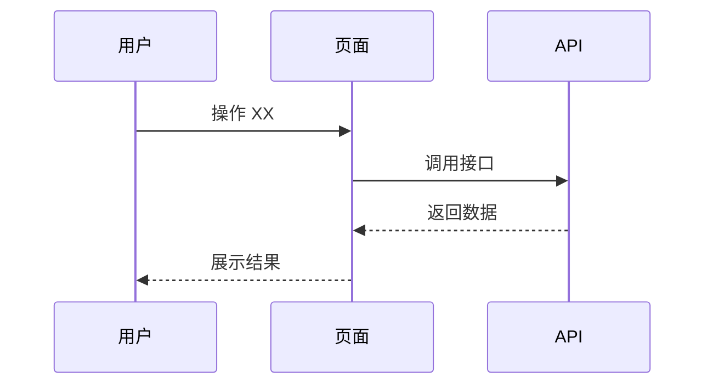

# F{xx} {模块名} — PRD

> 模块编号：F{xx}
> 模块英文名：{english-slug}
> 优先级：P0 / P1 / P2
> 最近更新：{YYYY-MM-DD}
> 当前迭代：v{x.y}
> [返回文档首页](../../README.md)

---

## 一、模块概述

### 1.1 定位

{一句话说清这个模块解决什么问题}

### 1.2 用户与场景

| 用户角色 | 场景 | 期望 |
|---------|------|------|
| {角色 1} | {使用场景} | {期望结果} |
| {角色 2} | {使用场景} | {期望结果} |

### 1.3 核心价值

- {价值点 1}
- {价值点 2}

---

## 二、功能清单

| 功能点 | 描述 | 优先级 |
|--------|------|--------|
| F{xx}.1 | {功能描述} | P0 |
| F{xx}.2 | {功能描述} | P1 |

---

## 三、用户故事 & 验收标准

### US-{xx}.1 {故事标题}

**作为** {角色}，**我希望** {功能}，**以便** {价值}。

**验收标准：**

- [ ] {可验证条件 1}
- [ ] {可验证条件 2}
- [ ] {异常场景处理}

### US-{xx}.2 {故事标题}

（同上格式）

---

## 四、页面 & 交互（如涉及前端）

### 4.1 页面清单

| 页面 | 路径 | 说明 |
|------|------|------|
| {页面名} | `/path` | {功能描述} |

### 4.2 关键交互

---

## 五、业务规则

### 5.1 正常流程

1. {步骤 1}
2. {步骤 2}
3. {步骤 3}

### 5.2 异常处理

| 异常场景 | 处理策略 | 用户提示 |
|---------|---------|---------|
| {场景 1} | {策略} | {提示文案} |

### 5.3 边界条件

- {边界 1}（如：单次导入最多 N 条）
- {边界 2}

---

## 六、数据需求

### 6.1 字段清单（不涉及表结构）

| 字段 | 说明 | 必填 | 备注 |
|------|------|------|------|
| {字段 1} | {说明} | 是 | {业务约束} |
| {字段 2} | {说明} | 否 | |

### 6.2 数据来源与流向

{说明数据从哪里来、到哪里去}

---

## 七、非功能需求

| 维度 | 要求 |
|------|------|
| 性能 | {P95 响应时间} |
| 安全 | {权限、脱敏} |
| 可用性 | {降级策略} |
| 兼容性 | {浏览器/客户端版本} |

---

## 八、依赖与边界

### 8.1 依赖的其他模块

- F{yy} {模块名}：{依赖关系}

### 8.2 影响的其他模块

- F{zz} {模块名}：{影响内容}

### 8.3 不在本模块范围

- {明确不做的事 1}
- {明确不做的事 2}

---

## 九、开放问题

- {待确认点}

---

## 附：变更历史

| 版本 | 日期 | 变更 |
|------|------|------|
| v{x.y} | {YYYY-MM-DD} | {本次变更} |
| v{x.y-1} | {YYYY-MM-DD} | {历史变更} |
