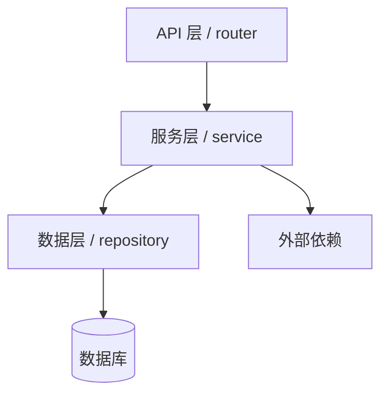
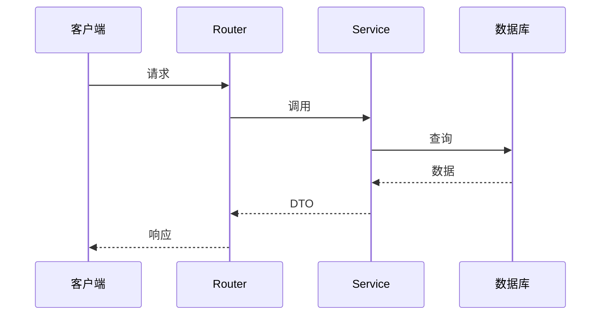
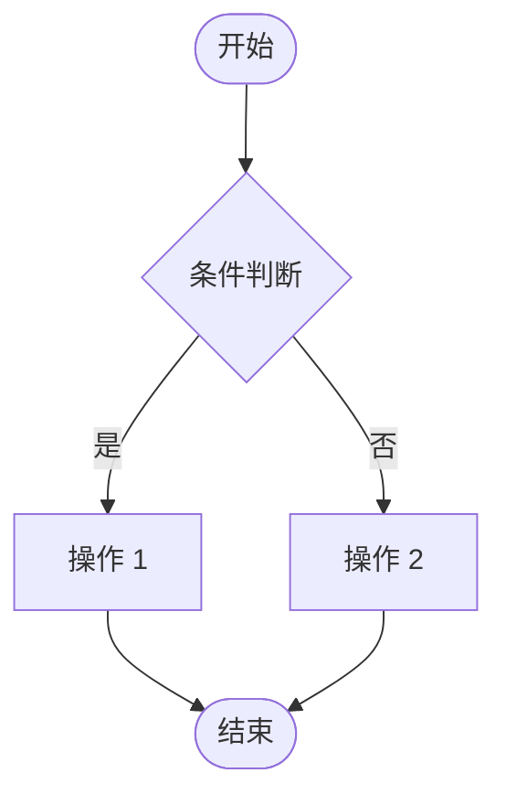

# F{xx} {模块名} — TECH

> 模块编号：F{xx}
> 对应 PRD：[PRD.md](./PRD.md)
> 最近更新：{YYYY-MM-DD}
> 当前迭代：v{x.y}
> [返回文档首页](../../README.md)

---

## 一、方案概述

### 1.1 技术路线

{一段话说明整体技术选型和核心思路}

### 1.2 关键决策

| 决策点 | 选择 | 备选 | 理由 |
|--------|------|------|------|
| {决策 1} | {采用方案} | {未采用方案} | {选择理由} |
| {决策 2} | {采用方案} | {未采用方案} | {选择理由} |

---

## 二、模块设计

### 2.1 分层结构



### 2.2 类/组件清单

| 组件 | 职责 | 所在文件 |
|------|------|---------|
| `ClassA` | {说明} | `app/services/xxx.py` |
| `ClassB` | {说明} | `app/models/xxx.py` |

### 2.3 核心时序



---

## 三、数据库设计

### 3.1 表结构

```sql
CREATE TABLE og_{table_name} (
    id              BIGINT PRIMARY KEY AUTO_INCREMENT,
    {field_1}       VARCHAR(64) NOT NULL,
    {field_2}       INT DEFAULT 0,
    created_at      DATETIME DEFAULT CURRENT_TIMESTAMP,
    updated_at      DATETIME DEFAULT CURRENT_TIMESTAMP ON UPDATE CURRENT_TIMESTAMP,
    KEY idx_{field} ({field_1})
) ENGINE=InnoDB;
```

### 3.2 索引策略

| 索引 | 字段 | 用途 |
|------|------|------|
| `PRIMARY` | `id` | 主键 |
| `idx_xxx` | `field_1` | {查询场景} |

### 3.3 迁移脚本

```bash
alembic revision --autogenerate -m "F{xx} add table"
alembic upgrade head
```

---

## 四、API 设计

### 4.1 接口清单

| 方法 | 路径 | 说明 |
|------|------|------|
| GET | `/api/admin/xxx` | 列表 |
| POST | `/api/admin/xxx` | 创建 |
| PUT | `/api/admin/xxx/{id}` | 更新 |
| DELETE | `/api/admin/xxx/{id}` | 删除 |

### 4.2 请求/响应

#### `POST /api/admin/xxx`

**请求体：**

```json
{
  "field_1": "string",
  "field_2": 0
}
```

**响应体：**

```json
{
  "code": 0,
  "message": "ok",
  "data": {
    "id": 1
  }
}
```

### 4.3 错误码

| 错误码 | HTTP | 含义 |
|--------|------|------|
| `XXX_001` | 400 | 参数错误 |
| `XXX_002` | 404 | 资源不存在 |

---

## 五、关键流程

### 5.1 {核心流程名}



---

## 六、安全设计

| 维度 | 设计 |
|------|------|
| 鉴权 | {Token / JWT / Session} |
| 输入校验 | {Pydantic / 自定义校验} |
| 敏感字段脱敏 | {手机号/邮箱掩码} |
| SQL 注入防护 | {ORM 参数化} |
| 速率限制 | {Redis 令牌桶} |

---

## 七、配置项

| 环境变量 | 默认值 | 说明 |
|---------|--------|------|
| `XXX_ENABLED` | `true` | 是否启用 |
| `XXX_TIMEOUT` | `30` | 超时秒数 |

---

## 八、部署 & 运维

### 8.1 部署动作

- [ ] 执行 Alembic 迁移
- [ ] 配置新环境变量
- [ ] 重启服务

### 8.2 回滚

- 数据库：`alembic downgrade -1`
- 代码：`git revert` 对应 commit

### 8.3 监控

- 关键指标：{QPS / 错误率 / 延迟}
- 告警：{阈值}

---

## 九、性能与容量

| 场景 | 预估 QPS | 预估延迟 | 容量预估 |
|------|---------|---------|---------|
| {场景 1} | {N} | {ms} | {数据量} |

---

## 十、测试策略

| 测试类型 | 覆盖范围 |
|---------|---------|
| 单元测试 | {服务层核心方法} |
| 集成测试 | {API 端到端} |
| 手工回归 | {UI 流程} |

---

## 十一、依赖

- 外部服务：{服务名 + 版本}
- 第三方库：{库名 + 版本}
- 内部模块：F{yy}

---

## 附：变更历史

| 版本 | 日期 | 变更 |
|------|------|------|
| v{x.y} | {YYYY-MM-DD} | {本次变更} |
